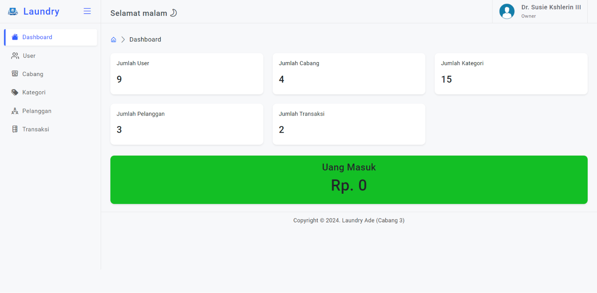
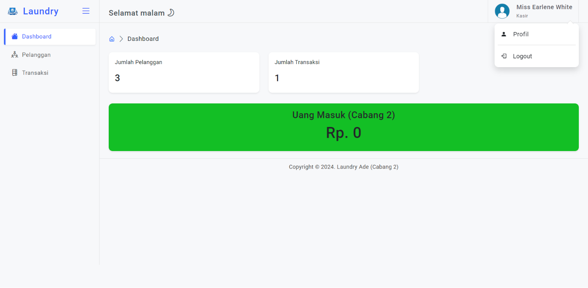

# Aplikasi Web Laundry

Aplikasi web laundry ini dirancang untuk mengelola data laundry dengan dua peran utama: Owner dan Kasir. Aplikasi ini menyediakan berbagai fitur untuk mempermudah pengelolaan laundry di berbagai cabang.

## Fitur

### Role Owner
- **Dashboard**: Menampilkan statistik jumlah pengguna, cabang, kategori, pelanggan, dan transaksi, serta uang masuk per bulan di semua cabang.
- **User**: Menambahkan, melihat, mengubah, dan menghapus data pengguna.
- **Cabang**: Menambahkan, melihat, mengubah, dan menghapus data cabang.
- **Kategori**: Menambahkan, melihat, mengubah, dan menghapus data kategori.
- **Pelanggan**: Menambahkan, melihat, mengubah, dan menghapus data pelanggan.
- **Transaksi**: Melihat data transaksi dan detail transaksi.

### Role Kasir
- **Dashboard**: Menampilkan statistik jumlah pelanggan dan jumlah transaksi sesuai dengan cabang kasir yang sedang login.
- **Pelanggan**: Menambahkan, melihat, mengubah, dan menghapus data pelanggan.
- **Transaksi**: Menambahkan, melihat, mengubah, dan menghapus data transaksi serta detail transaksi.

### Profil
- **Profil**: Mengupdate data diri profil yang sedang login. Fitur ini dapat diakses oleh Owner dan Kasir.

### Wireframe Web
Untuk rancangan kasar visual mengenai tampilan website, Anda dapat melihat wireframe aplikasi web laundry di sini: [Wireframe Web](https://whimsical.com/laundry-Ka4hTZg2yTrc1HCPyogy24){:target="_blank"}

## Screenshots

### Login


### Menu Owner


### Menu Kasir


## Instalasi

1. Clone repository ini:
    ```bash
    git clone https://github.com/username/repository.git
    ```

2. Masuk ke direktori proyek:
    ```bash
    cd repository
    ```

3. Install dependensi:
    ```bash
    composer install
    ```

4. Buat file `.env` dari file `.env.example`:
    ```bash
    cp .env.example .env
    ```

5. Generate key aplikasi:
    ```bash
    php artisan key:generate
    ```

6. Jalankan migrasi database:
    ```bash
    php artisan migrate
    ```

7. Jalankan server:
    ```bash
    php artisan serve
    ```

## Kontribusi

Jika Anda ingin berkontribusi pada proyek ini, silakan fork repository ini, buat branch baru, dan buat pull request dengan deskripsi perubahan yang Anda buat. Terimakasih😊
