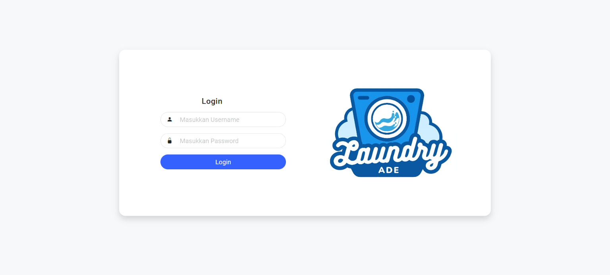

# Aplikasi Web Laundry

Selamat datang di aplikasi web laundry! Aplikasi ini dirancang untuk memudahkan pengelolaan data laundry dengan dua peran utama: Owner dan Kasir. Dengan berbagai fitur canggih, aplikasi ini membantu Anda mengelola semua aspek laundry di berbagai cabang dengan lebih efisien.

## Wireframe Web

Untuk melihat tampilan kasar dan desain aplikasi web laundry, silakan kunjungi wireframe [di sini](https://whimsical.com/laundry-Ka4hTZg2yTrc1HCPyogy24).

## Fitur Utama

### Role Owner
- **Dashboard**: Akses statistik lengkap seperti jumlah pengguna, cabang, kategori, pelanggan, transaksi, dan pendapatan bulanan di seluruh cabang.
- **Manajemen Pengguna**: Tambah, lihat, edit, dan hapus data pengguna.
- **Manajemen Cabang**: Tambah, lihat, edit, dan hapus data cabang.
- **Manajemen Kategori**: Tambah, lihat, edit, dan hapus data kategori.
- **Manajemen Pelanggan**: Tambah, lihat, edit, dan hapus data pelanggan.
- **Manajemen Transaksi**: Lihat data transaksi dan detail transaksi.

### Role Kasir
- **Dashboard**: Lihat statistik jumlah pelanggan dan transaksi sesuai dengan cabang tempat kasir login.
- **Manajemen Pelanggan**: Tambah, lihat, edit, dan hapus data pelanggan.
- **Manajemen Transaksi**: Tambah, lihat, edit, dan hapus data transaksi serta detail transaksi.

### Profil
- **Profil Pengguna**: Update data diri untuk pengguna yang sedang login. Fitur ini dapat diakses oleh Owner dan Kasir.

## Screenshots

### Login


### Menu Owner


### Menu Kasir


## Instalasi

Ikuti langkah-langkah di bawah ini untuk menginstal aplikasi ini:

1. Clone repository:
    ```bash
    git clone https://github.com/username/repository.git
    ```

2. Akses direktori proyek:
    ```bash
    cd repository
    ```

3. Install dependensi:
    ```bash
    composer install
    ```

4. Buat file `.env`:
    ```bash
    cp .env.example .env
    ```

5. Generate kunci aplikasi:
    ```bash
    php artisan key:generate
    ```

6. Jalankan migrasi database:
    ```bash
    php artisan migrate
    ```

7. Jalankan server:
    ```bash
    php artisan serve
    ```

## Kontribusi

Jika Anda ingin berkontribusi pada proyek ini, silakan fork repository ini, buat branch baru, dan buat pull request dengan deskripsi perubahan yang Anda buat. Terimakasih😊
